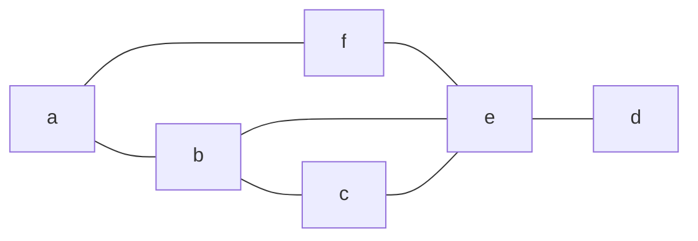
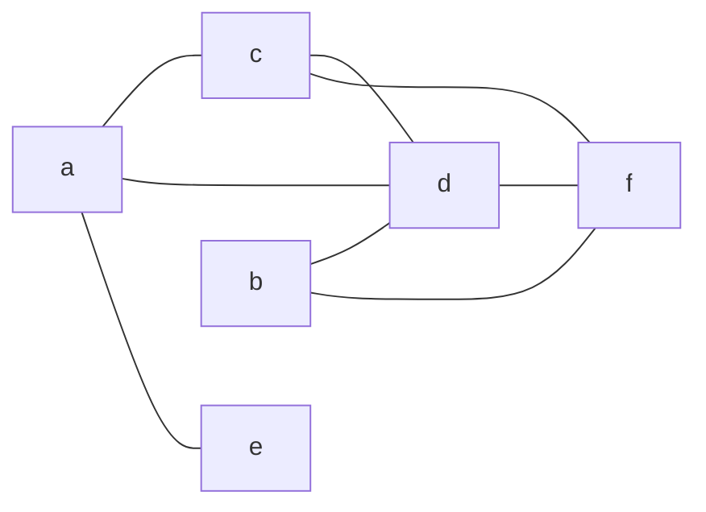

# Esercizio 2 — Riduzione da CLIQUE a VERTEX-COVER su grafo concreto

## Testo

Dato il grafo $G$ sotto riportato, disegnare il grafo $G'$ che si ottiene nella riduzione da **CLIQUE** a **VERTEX COVER**, indicando quanti e quali sono i vertici della copertura di vertici di $G'$.

La copertura di vertici di $G'$ è composta dai seguenti vertici: .............................................................. in numero pari a ......

---

## Analisi del Grafo Originale $G$

Basandoci sulla descrizione censita nel piano d'azione (estrattore strutturato dal PDF d'esame), il grafo originale $G = (V,E)$ ha:
* **Vertici**: $V = \{a, b, c, d, e, f\}$ (quindi $|V| = 6$)
* **Archi**: $E = \{(a,b), (a,f), (f,e), (b,e), (b,c), (c,e), (e,d)\}$

Visualizziamo il grafo $G$ tramite Mermaid:

---

## Risoluzione

### 1. Costruzione del Grafo Complementare $G'$
La riduzione polinomiale da CLIQUE a VERTEX-COVER prevede che il grafo di destinazione $G'$ sia il **grafo complementare** del grafo originale $G$ ($G' = \bar{G}$):
* I vertici rimangono gli stessi: $V' = V = \{a, b, c, d, e, f\}$.
* Gli archi di $G'$ sono tutti e soli gli archi non presenti in $G$ (rispetto a un grafo completo a 6 nodi, che possiede $\frac{6 \times 5}{2} = 15$ archi):
  $$E' = \{(u,v) \mid u, v \in V, u \neq v, (u,v) \notin E\}$$

Gli archi esclusi da $G'$ sono i 7 archi originali di $E$. Di conseguenza, gli archi del complementare $G'$ sono i restanti $15 - 7 = 8$ archi:
* $a$ si collega a: $c, d, e$
* $b$ si collega a: $d, f$
* $c$ si collega a: $d, f$
* $d$ si collega a: $f$

Disegniamo il grafo complementare $G'$ ottenuto:

---

### 2. Individuazione della Clique in $G$ e Vertex Cover in $G'$
La riduzione stabilisce una corrispondenza biunivoca:
$$\text{Un insieme di nodi } K \subseteq V \text{ è una Clique in } G \iff V \setminus K \text{ è un Vertex Cover in } G' = \bar{G}$$

Osserviamo il grafo originale $G$:
* Esiste una **clique di dimensione $k = 3$** formata dal triangolo $\{b, c, e\}$, poiché gli archi $(b,c)$, $(b,e)$ e $(c,e)$ sono tutti presenti in $E$.
* Cerchiamo la corrispondente coperture dei vertici (Vertex Cover) in $G'$ di dimensione:
  $$k' = |V| - k = 6 - 3 = 3$$
* La copertura complementare sarà:
  $$V \setminus \{b, c, e\} = \{a, d, f\}$$

Verifichiamo se $\{a, d, f\}$ è un Vertex Cover valido per $G'$ (cioè se ogni arco in $E'$ tocca almeno uno dei nodi in $\{a, d, f\}$):
* $(a,c)$ — coperto da $a$
* $(a,d)$ — coperto da $a$ e $d$
* $(a,e)$ — coperto da $a$
* $(b,d)$ — coperto da $d$
* $(b,f)$ — coperto da $f$
* $(c,d)$ — coperto da $d$
* $(c,f)$ — coperto da $f$
* $(d,f)$ — coperto da $d$ e $f$

Tutti gli 8 archi in $E'$ sono coperti. Di conseguenza, $\{a, d, f\}$ è una copertura di vertici valida per $G'$.

---

## Risposte da riportare sul foglio d'esame

* **Grafo $G'$**: (Disegnare il complementare mostrato sopra, con gli 8 archi).
* **Vertici della copertura di $G'$**: $\{a, d, f\}$
* **Numero di vertici**: 3

> [!Warning]
> *Nota di assunzione*: Sebbene il testo non fornisca il valore esplicito di $k$ per la clique cercata in $G$, l'unica clique massimale presente nel grafo originale $G$ è il triangolo $\{b,c,e\}$ di dimensione $k=3$. Di conseguenza, la soluzione univoca attesa è la copertura di dimensione $|V|-k = 6-3=3$ formata dai restanti nodi $\{a,d,f\}$.
