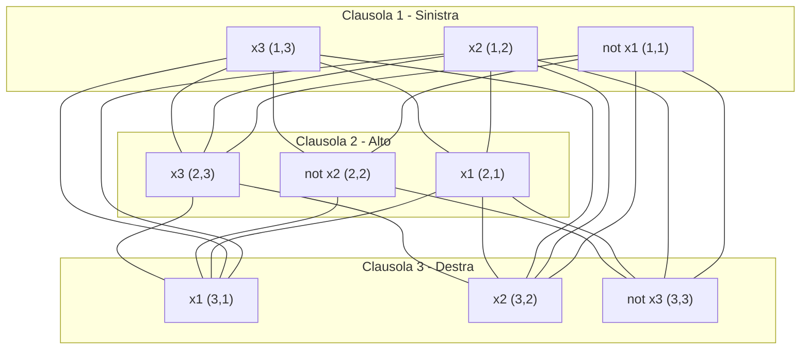

# Esercizio 2 — Riduzione da 3-CNF-SAT a CLIQUE

## Testo

Si consideri la formula 3-CNF-SAT:
$$f = (\neg x_1 \lor x_2 \lor x_3) \land (x_1 \lor \neg x_2 \lor x_3) \land (x_1 \lor x_2 \lor \neg x_3)$$

Disegnare nello spazio sottostante il grafo che si ottiene da $f$ nella riduzione polinomiale da **3-CNF-SAT (3-SAT)** a **CLIQUE**.

Rappresentare i vertici relativi alla prima clausola a sinistra, quelli relativi alla seconda clausola in alto e quelli relativi alla terza a destra.

---

## Risoluzione Guida Passo-Passo

### 1. Costruzione dei Vertici ($V$)
La formula $f$ contiene $k = 3$ clausole:
1. $C_1 = (\neg x_1 \lor x_2 \lor x_3)$
2. $C_2 = (x_1 \lor \neg x_2 \lor x_3)$
3. $C_3 = (x_1 \lor x_2 \lor \neg x_3)$

Ciascuna clausola ha 3 letterali. Creiamo un vertice per ciascun letterale di ciascuna clausola, ottenendo $3 \times 3 = 9$ vertici in totale:
* **Clausola 1 (Sinistra)**: 
  - $v_{1,1} = \neg x_1$
  - $v_{1,2} = x_2$
  - $v_{1,3} = x_3$
* **Clausola 2 (Alto)**: 
  - $v_{2,1} = x_1$
  - $v_{2,2} = \neg x_2$
  - $v_{2,3} = x_3$
* **Clausola 3 (Destra)**: 
  - $v_{3,1} = x_1$
  - $v_{3,2} = x_2$
  - $v_{3,3} = \neg x_3$

---

### 2. Costruzione degli Archi ($E$)
La regola di riduzione stabilisce che aggiungiamo un arco non orientato tra due vertici $v_{i,a}$ e $v_{j,b}$ se e solo se:
1. Appartengono a clausole diverse ($i \neq j$).
2. I loro letterali corrispondenti sono **compatibili** (cioè non sono l'uno il complementare dell'altro: $l_{i,a} \neq \neg l_{j,b}$).

Analizziamo i collegamenti tra le clausole:

#### A. Collegamenti tra Clausola 1 (Sinistra) e Clausola 2 (Alto)
* $v_{1,1} = \neg x_1$ si collega a:
  - $v_{2,2} = \neg x_2$ (compatibile)
  - $v_{2,3} = x_3$ (compatibile)
  - *Escluso*: $v_{2,1} = x_1$ (complementare!)
* $v_{1,2} = x_2$ si collega a:
  - $v_{2,1} = x_1$ (compatibile)
  - $v_{2,3} = x_3$ (compatibile)
  - *Escluso*: $v_{2,2} = \neg x_2$ (complementare!)
* $v_{1,3} = x_3$ si collega a:
  - $v_{2,1} = x_1$ (compatibile)
  - $v_{2,2} = \neg x_2$ (compatibile)
  - $v_{2,3} = x_3$ (compatibile)

#### B. Collegamenti tra Clausola 1 (Sinistra) e Clausola 3 (Destra)
* $v_{1,1} = \neg x_1$ si collega a:
  - $v_{3,2} = x_2$ (compatibile)
  - $v_{3,3} = \neg x_3$ (compatibile)
  - *Escluso*: $v_{3,1} = x_1$ (complementare!)
* $v_{1,2} = x_2$ si collega a:
  - $v_{3,1} = x_1$ (compatibile)
  - $v_{3,2} = x_2$ (compatibile)
  - $v_{3,3} = \neg x_3$ (compatibile)
* $v_{1,3} = x_3$ si collega a:
  - $v_{3,1} = x_1$ (compatibile)
  - $v_{3,2} = x_2$ (compatibile)
  - *Escluso*: $v_{3,3} = \neg x_3$ (complementare!)

#### C. Collegamenti tra Clausola 2 (Alto) e Clausola 3 (Destra)
* $v_{2,1} = x_1$ si collega a:
  - $v_{3,1} = x_1$ (compatibile)
  - $v_{3,2} = x_2$ (compatibile)
  - $v_{3,3} = \neg x_3$ (compatibile)
* $v_{2,2} = \neg x_2$ si collega a:
  - $v_{3,1} = x_1$ (compatibile)
  - $v_{3,3} = \neg x_3$ (compatibile)
  - *Escluso*: $v_{3,2} = x_2$ (complementare!)
* $v_{2,3} = x_3$ si collega a:
  - $v_{3,1} = x_1$ (compatibile)
  - $v_{3,2} = x_2$ (compatibile)
  - *Escluso*: $v_{3,3} = \neg x_3$ (complementare!)

---

## Rappresentazione Grafica del Grafo Risultante

Ecco il grafo di riduzione rappresentato tramite diagramma Mermaid in cui si osserva la disposizione spaziale richiesta (Clausola 1 a sinistra, Clausola 2 in alto, Clausola 3 a destra).

